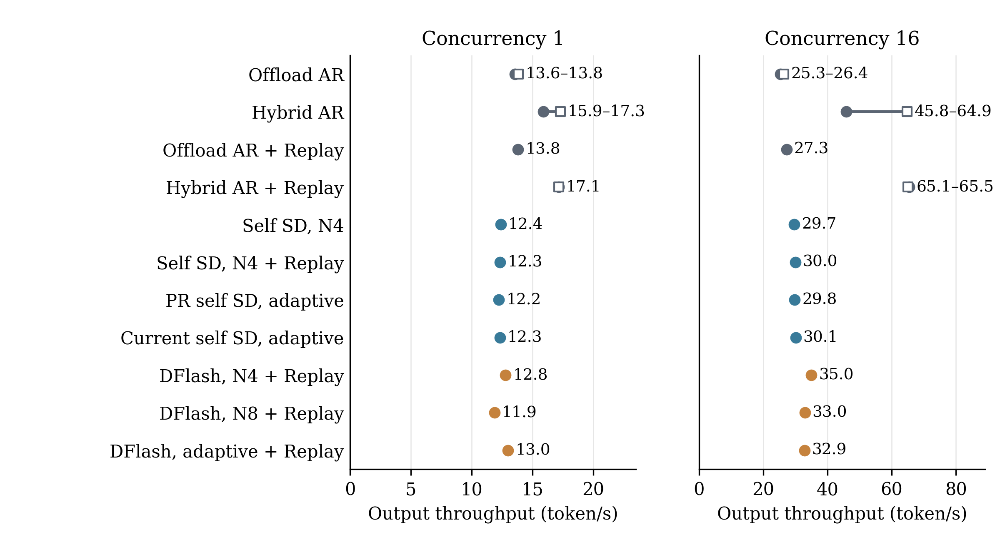
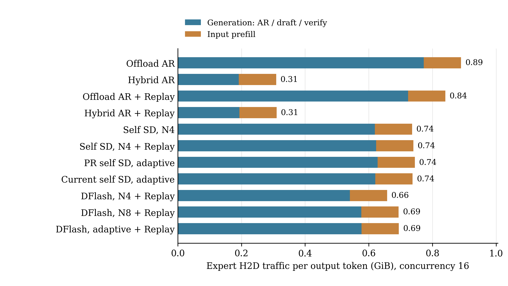

# DFlash 接入与受控性能比较（2026-09-30）

**主矩阵结论：DFlash 固定4步的 C16 吞吐为35.02 token/s，比当前 self-SD 的30.11高16.3%，但低于 hybrid AR。C1 暂无收益。** 公共起草接口的重构没有在本次短测中出现明显性能回退。实现、远端部署、六组独立服务验收及逆序性能复跑均已完成。

## 同样的资源，比较什么

租用机器 `108.39.26.2:42624` 的单张4090；Qwen3.6-35B-A3B BF16，FlashInfer，Graph，legacy 调度。专家池固定1536槽（9 GiB），目标KV固定4096 token，状态与DFlash合计预算6245744640字节；最大16请求、序列1024、prefill分块512。宿主为双路 AMD EPYC 7B13，容器CPU配额30.6核；所有进程绑定同一NUMA节点上的CPU核64–93，hybrid 使用24个工作线程与实测带宽配置；本轮不启用预取、近似verify或固定驻留。

少专家SD统一使用k=3、缓存路由＋补缺加载，因此draft仍可能搬运少量专家。Replay的记录环为32；DFlash使用匹配的 `Qwen3.6-35B-A3B-DFlash`，自适应从2／4／8步选择整块，尾批按剩余输出缩短。

基线为[ReplaySSM PR #3](https://github.com/ServeBig-project/FreeToken/pull/3)的 `8422e1b`，其生产 Python 与重构起点 `54b8ab1` 相同。新代码的生产版本为 `481994f`，主性能矩阵测试版本为 `0e2ecf4`；Qwen3服务测试经输入构造修正后为 `c6e5bcc`。SD沿用现有GPU专家执行范围；**hybrid AR可用，hybrid SD目前明确不支持**。

冻结16条coding／research短提示；每臂独立重启，先预热。C16计分两波，每波16×64 token；C1计分4×64 token，共2304输出token／臂。吞吐包含输入处理，预热排除；这是服务性能短测，不是完整agent任务评测。采样为greedy、固定长度；输入相同不意味着不同数值路径的文本逐字相同。

## 性能结果

带“／”的单元格依次为首轮／逆序复跑，其余只运行一次。GPU逐臂独占，CPU线程和亲和性固定，但未预留独占宿主CPU。**hybrid AR不开Replay也在复跑达到64.86，与Replay的65.06接近，首轮45.83→65.48不能当成Replay的独立收益。**

| 方案 | C1 token/s | C16 token/s |
| --- | ---: | ---: |
| Offload AR（主基线） | 13.57／13.83 | 25.30／26.38 |
| Hybrid AR | 15.90／17.28 | 45.83／64.86 |
| Offload AR＋Replay | 13.81 | 27.25 |
| Hybrid AR＋Replay | 17.15／17.14 | 65.48／65.06 |
| PR self-SD，固定4步 | 12.40 | 29.70 |
| PR self-SD，固定4步＋Replay | 12.34 | 30.00 |
| PR self-SD，自适应8步＋Replay | 12.23 | 29.83 |
| 当前 self-SD，自适应8步＋Replay | 12.33 | 30.11 |
| DFlash，固定4步＋Replay | 12.78 | 35.02 |
| DFlash，固定8步＋Replay | 11.88 | 33.00 |
| DFlash，自适应8步＋Replay | 12.99 | 32.87 |

**图1. 相同请求和资源预算下的输出吞吐。** C1与C16分别计分；N4／N8表示最多4／8个草稿token，不含验证锚点。蓝色为少专家self-SD，橙色为DFlash。除表中显式无Replay的方案外，SD均启用Replay。圆点是首轮，空心方块是逆序复跑；每点均来自一次独立启动，C16合并两波计分。连接线仅表示两次实际结果的范围，不是置信区间。[矢量PDF](figures/dflash-20260930/throughput.pdf)

## 为什么 draft 快很多，总吞吐只提高一部分

**验证仍要搬很多专家。** 以C16计分区间为例，offload AR平均每次forward加载约2143个专家，输出16 token；DFlash固定4步平均每次verify加载约3854个专家，输出约41 token（含自然尾批）。一次验证能多输出，但也涉及更大的专家集合。verify按需加载，并不是整层专家全部加载。

更直接的估算是：**时间≈专家传输字节数÷PCIe有效带宽**。DFlash固定4步计分阶段累计搬运1.446 TB（含同一专家的重复搬运），实测PCIe约25–26 GB/s，仅搬运就对应约56–58秒；真实端到端耗时58.48秒。在当前传输量不变时，单独优化GPU计算很难再获得大幅提速。

DFlash固定4步的草稿logits准备与模型计算，每个批次调用平均4.14 ms（每请求最多4个草稿token，包含自然尾批），累计0.203秒，占58.48秒端到端时间约0.35%；这不包含后续的概率过滤、采样和候选写入。两种自适应模式均开启了目标forward计时，可以比较以下累计区间：

| C16计分区间（2048 token） | 当前 self-SD 自适应 | DFlash 自适应 |
| --- | ---: | ---: |
| 起草模型计算累计时间 | 3.268 s | 0.180 s |
| verify模型计算累计时间 | 43.455 s | 45.481 s |
| AR模型计算累计时间 | 10.597 s | 6.126 s |
| 专家按需搬运计时间隔 | 52.214 s | 48.699 s |
| draft加载专家次数 | 5,443 | 0 |
| verify加载专家次数 | 170,920 | 178,410 |

这些是CUDA事件测得的执行区间，包含区间内等待，不包含后续的采样与接受／拒绝流程；搬运时间包含在forward时间内，不能将各行相加。固定长度模式未开启完整target分段计时，不能把未记录的verify时间写成零。

**图2. C16每个输出token对应的专家权重CPU→GPU传输量。** 图中采用首轮矩阵，从每波请求前后的公开累计计数求差；蓝色包含AR／draft／verify的生成阶段，橙色为输入prefill。DFlash固定4步从offload AR的0.890降到0.658 GiB/token；hybrid AR约0.309，因为部分缺失专家直接在CPU计算。该图只统计专家权重H2D，不代表CPU内存总流量。[矢量PDF](figures/dflash-20260930/expert-traffic.pdf)

**长块和自适应均未自动获益。** DFlash从4步改8步，草稿接受率60.5%→38.6%，吞吐35.02→33.00。自适应本轮主要选择2步（计分期间42次），4步仅1次，另有19次直接AR；它没有找到本次固定4步的最好结果。应保留固定长度对照，不能把当前成本模型视为已调优。

## 显存与验收边界

DFlash权重约736 MiB、持久历史KV约96 MiB、固定工作区约21 MiB，合计约853 MiB，从状态预算扣除。N8＋Replay时完整状态容量由self-SD的91槽降到77槽；专家池与目标KV未缩小。公共前缀仍同时复用目标历史和DFlash历史；完整状态快照容量降低可能影响长agent轨迹，本轮短测不覆盖该收益／代价。

实际GPU峰值（含启动、每2秒采样）为：offload AR约21044 MiB，当前self-SD自适应22512 MiB，DFlash固定4步22214 MiB、固定8步22720 MiB。Graph等非PyTorch占用已包含在进程所在GPU的总占用中；采样峰值不能保证捕获瞬时最高点。

性能运行共14次（11个配置＋3次复跑），合计504个计分请求、32256 token，输入一致，无公开错误、长度／usage／汇总错误。DFlash固定4／8／自适应相对offload AR分别有20／18／16条（共36条）文本不同；AR自身两波C16也有9/16不同。人工查看未见明显乱码，但64-token截断输出不能证明完整答案质量或采样分布等价。

独立小模型数学参考在CPU和CUDA上均8/8通过。CUDA的FP32最大绝对误差1.18e-5、最大归一化均方根误差6.90e-7；BF16相对显式舍入参考分别为0.03223、0.00805，均在预先固定的门槛内。这是模型计算入口的验证，不等于完整任务质量证明。

逆序复跑没有复现hybrid AR的43% Replay收益：offload AR为25.30／26.38，hybrid AR为45.83／64.86，hybrid＋Replay为65.48／65.06。只能确认本轮hybrid AR明显快于offload后端的SD；宿主运行波动的原因没有被隔离。

独立服务验收共6组、90项全部通过：DFlash固定N8＋Replay、DFlash自适应＋Replay、DFlash关闭Replay、Qwen3.6 self-SD固定N4、Qwen3 self-SD固定N4／自适应N8。每组均覆盖并发、尾批、前缀、停止／取消和重建；各组覆盖缺失与运行内文本差异均为0。DFlash固定N8实际覆盖C16×144位置的draft与verify Graph。

Qwen3测试过程中修正了测试客户端的无GDN重建参数及长输入样本；原始失败记录保留在实验根目录的 `failed-client/`。最终文本在两份实际tokenizer上分别为576／648 token，不使用本服务不支持的token-ID输入，覆盖条件没有放宽。

## 复现与代码量

原始命令、模型版本、输出、计时、Graph形状、显存采样均保留在 `/data2/servebig-envs/dflash_integration_20260930/remote-results/`；对应远端目录为 `/workspace/servebig-project/results/dflash_20260930/campaign/`。独立最终汇总为 `remote-results/service-public-audit.json`；带宽标定与CPU／CUDA数值结果均在实验根目录。`campaign-summary.json`与汇总、绘图脚本在本地实验根目录；部署环境说明在远端 `/workspace/servebig-project/deployment/`。

本轮生产代码相对 `54b8ab1`：**增加952、删除128、净增824行**；不含文档、测试、模型、生成图和第三方代码。独立测试Python为**增加1210、删除0、净增1210行**，另有冻结输入165行和说明文档237行，不混入生产代码。

| 生产阶段 | 提交 | 增加 | 删除 | 净增 |
| --- | --- | ---: | ---: | ---: |
| 公共drafter边界 | `af20e07` | 132 | 66 | 66 |
| DFlash原生模型 | `de7f6a4` | 192 | 0 | 192 |
| 按块成本选择 | `c91d67b` | 118 | 0 | 118 |
| 分块长度接受率估计 | `237749e` | 26 | 2 | 24 |
| 状态预算与公开计价 | `9738268` | 104 | 26 | 78 |
| 公共历史及运行时集成 | `cd3445e` | 361 | 21 | 340 |
| 最后短prefill块快照修复 | `481994f` | 23 | 17 | 6 |

分阶段统计包含后续改写，最终差分为952／128；两种口径净增同为824。
